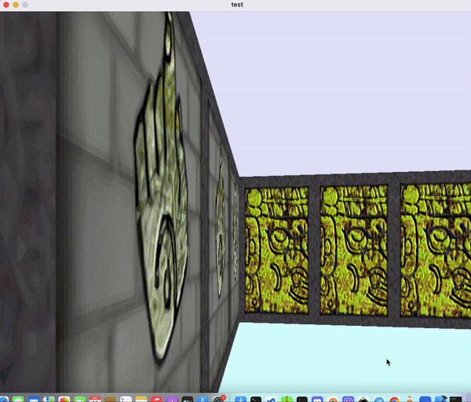

# cub3d




cub3D is a 3D graphical representation of a maze, inspired by Wolfenstein 3D, using ray-casting techniques. This project enhances your skills in C programming, mathematics, and graphical design through MiniLibX.

---

## **Table of Contents**
- [Goals](#goals)
- [Features](#features)
- [Requirements](#requirements)
- [Installation](#installation)
- [Usage](#usage)
- [Map Configuration](#map-configuration)
- [Demo](#demo)
- [License](#license)

---

## **Goals**

The objectives of this project include:
- Mastering C programming and algorithm design.
- Exploring graphical programming with MiniLibX.
- Using mathematics to implement efficient and elegant algorithms.

### **What You'll Learn**
- Handling windows, colors, events, and shapes.
- Managing memory and avoiding segmentation faults.
- Parsing files and rendering dynamic graphics.

---

## **Features**

- Realistic 3D first-person view of a maze using ray-casting.
- Movement controls (W, A, S, D, and arrow keys).
- Floor and ceiling color customization.
- Textured walls based on direction (North, South, East, West).
- Smooth window management and event handling.
- Comprehensive error handling for map configurations.

---

## **Requirements**

- **C Compiler**: GCC or equivalent with support for `-Wall -Wextra -Werror` flags.
- **Libraries**:
  - [MiniLibX](https://github.com/42Paris/minilibx-linux) for graphics.
  - Math library (`-lm`).
- Compatible with Linux or macOS.

---

## **Installation**

1. Clone the repository:
   ```bash
   git clone https://github.com/your_username/cub3D.git
   cd cub3D
   ```

2. Build the project:
   ```bash
   make
   ```

3. (Optional) Build the bonus version:
   ```bash
   make bonus
   ```

---

## **Usage**

1. Run the program with a valid `.cub` map file:
   ```bash
   ./cub3D path/to/map.cub
   ```

2. Use the following controls to navigate the maze:
   - `W`, `A`, `S`, `D`: Move forward, left, backward, and right.
   - Arrow keys: Look left or right.
   - `ESC`: Exit the program.

---

## **Map Configuration**

The `.cub` file defines the maze structure, wall textures, and floor/ceiling colors.

### **Map Rules**
- **Textures**: Define paths to textures for each wall direction (NO, SO, WE, EA).
- **Colors**: Specify RGB values for the floor (`F`) and ceiling (`C`).
- **Map**: Use `1` for walls, `0` for empty space, and `N`, `S`, `E`, `W` for the player's start position and orientation.

### **Example .cub File**
```plaintext
NO ./textures/north_texture.xpm
SO ./textures/south_texture.xpm
WE ./textures/west_texture.xpm
EA ./textures/east_texture.xpm
F 220,100,0
C 225,30,0

111111
100001
1000N1
100001
111111
```

### **Error Handling**
The program will exit with a clear error message if:
- The map is not surrounded by walls.
- Textures or colors are missing or misconfigured.


